# User guide for IR Workshop

## 1. General

### Saving and loading presets
Presets can be saved and loaded using he File->Open and File->Save commands in the top left context menu. Presets are saved with an .irw extension, and contain human-readable Json-encoded text data.

A default program named Default.irw is found in the main program directory. This is the program that gets loaded when you select File->New. You can overwrite this file to change the default settings.

### Exporting to .WAV

Select File->Export Wav to save the impulse response to a .wav file.
Once saved, 3 files will be written to disk:

* A stereo file containing both the left and right channel impulse responses.
* A mono file with a "-L" added to the name, containing the left channel impulse response only.
* A mono file with a "-R" added to the name, containing the right channel impulse response only.

### Live Preview
The program includes a real-time audio engine that can be used to preview the effects of the impulse response. It supports most Windows audio driver types, including ASIO, WASAPI and WDM. The real-time processing is performed in a separate Windows process, to minimize glitches and clicks caused by updates from the Graphical user interface. 

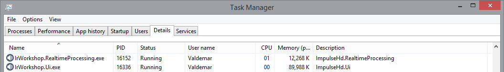

If the real-time process encounters an error, a dialog with error information will be raised in the GUI. If you encounter errors repeatedly, try adjusting your Device Settings (see Master Tab). If problems persist, please send send the error information to the support email.

## 2. Master Tab
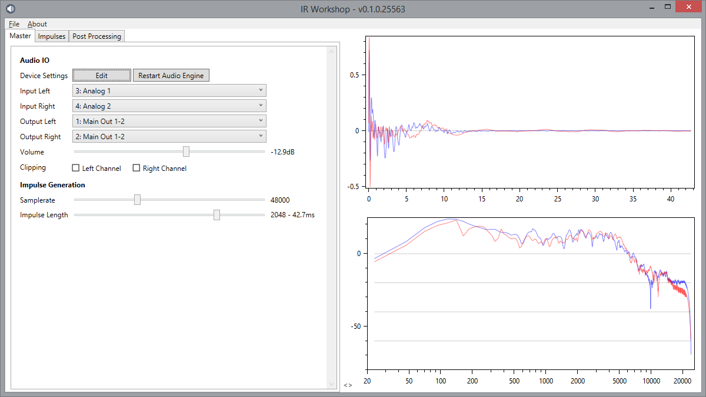

This tab controls real-time audio processing (live preview) and shows the final output impulse response, for the left and right channels, in both time and frequency domain.

### Audio IO

**Edit** - Opens the Device settings dialog, which allows you to choose your desired audio device, driver type, samplerate and buffer size.

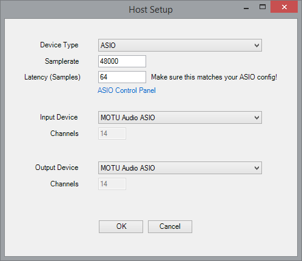

* Please be sure to select only supported samplerates for your audio device.
* If your audio device has its own dedicated control panel, make sure that the buffer setting there matches the Latency (samples) selected on this panel. Not doing so can result in glitchy audio.

**Restart Audio Engine** - Click this to completely restart the real-time process with the current settings. This can sometimes resolve audio dropouts and bad behaviour.

**Inputs and Outputs** - Select your desired stereo input and output. You can select the same port as both input Left and Right if you are working with a mono input signal.

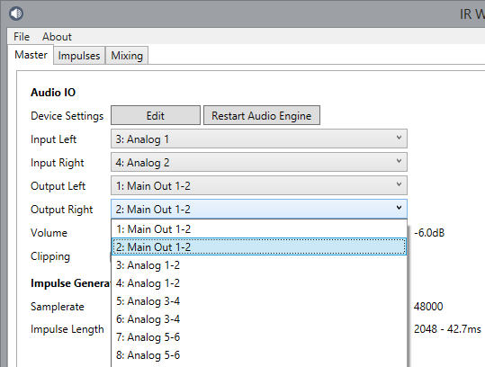

**Volume** - Controls the output gain of the real-time preview.

**Clipping** - These indicators light up if the output signal goes above 0dB. At that point the signal gets clipped and this will caused unwanted distortion. Use the volume slider to reduce the gain until clipping goes away.   

### Impulse Generation

**Samplerate** - this is the samplerate of the impulse response file that is generated. You can select 44.1Khz, 48Khz, 88.2Khz and 96Khz. When using real-time preview, make sure the samplerate of your audio device matches the selected samplerate here. If they don't match, the resulting sound will not be correct, and a warning is displayed on the panel.

**Impulse Length** - Specifies how long the resulting impulse will be. Options range from 256 samples to 4096 samples. Choose the option that is compatible with your impulse response loader or device.

* Digitech GSP1101 can only load short 256 sample files.
* Atomic Amplifire can load 1024 sample files.
* Line 6 Helix can load 2048 sample files.
* Axe FXII can load 4096 sample files in Ultra-res mode.
* Various VSTs can load arbitrarily long impulse responses.
* The built-in real-time preview in IR Workshop supports responses up to 4096 samples long, but older/slower CPUs may have difficulty with higher settings.

## 3. Impulses

This tab lists all the individual impulse responses in your preset. You can combine as many as you want.

On the left side you will see a tab for each impulse response. The tabs show a checkbox to enable or disable the IR, and the specified name. The name is only used to remind you which IR is which and serves no other purpose.

In the bottom left corner there are buttons for adding, removing and reordering the IRs. The order is only important when using the Apply feature (see below).

In the middle of the screen you see the main controls for the IR.

**Sample / Load Sample** - The .wav IR file selected. Note than you don't need to select a file at all, in which case the response defaults to a completely flat frequency response with zero phase. This can be useful for designing frequency responses from scratch.
The arrow buttons at the top can be used to scroll back and forth between IR .wav files in the same directory.

**Name** - Choose a name for this impulse response, it will show up on the left side and in the "Apply" dropdown box (see below).

**Base / L / R** - These buttons decide what gets displayed on the bottom right graph:

* Base - Shows the impulse response generated after the currently selected Spectrum Stage.
* L - Shows the left channel impulse response generated after the Output Stage.
* R - Shows the right channel impulse response generated after the Output Stage.

The top graph always shows the frequency response after the selected Spectrum Stage.

**Start** - Allows chopping off part of the data from the start of the .wav file. Can be used to eliminate leading zeroes (although a better result is often achieved using the "Minimum Phase" option, described below).

**Clear Sample** - Removes the selected .wav file and resets the impulse back to unity gain with zero phase.

**Solo** - Only the selected impulse response will be audible in the final mix.

**Left / Right** - If a stereo .wav file is selected, lets you choose which channel is used as input. For mono files, this is always "Left".

**Arrows** - Move the currently selected Spectrum Stage backwards or forwards in the series.

### Spectrum Stages

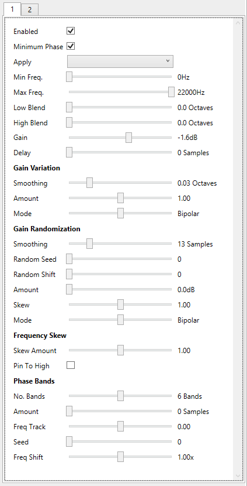

This section is used to apply transformations to the frequency response. It contains multiple powerful tools that can completely re-shape the gain and phase response of an IR, and can be combined to create brand new sounds. An unlimited number of spectrum stages can be added, and they are applied serially one after the other.

**Enabled** - enables or bypasses the stage.

**Minimum Phase** - Applies a special (Hilbert) transform that re-calculates the phase response, so that the overall delay is minimized. Minimum phase IRs also mix together much better as you have less phase cancellation between signals. 
*Warning*: Enabling this option will undo any phase transformations applied by earlier Spectrum stages, so be sure to apply any stages that affect the phase last.

**Apply** - Here you can select another impulse response to be applied on top of the current response. This can be very useful for adding a microphone response on top of a "neutral" cabinet response, to simulate the effect of a mic'ed cabined. Any impulse response **that appears before the currently selected impulse response** can be selected (use the arrows in the bottom left corner to adjust the order). You can even apply a disabled impulse response (one that doesn't otherwise get mixed into the final output).

**Min / Max Freq.** - Each spectrum stage can be limited to a certain range of frequencies, use these sliders to set the range.

**Low / High Blend** - Allows you to gradually blend the effect of this spectrum stage in and out.

Blending in a -24dB gain cut between ~250hz and 2.5Khz.
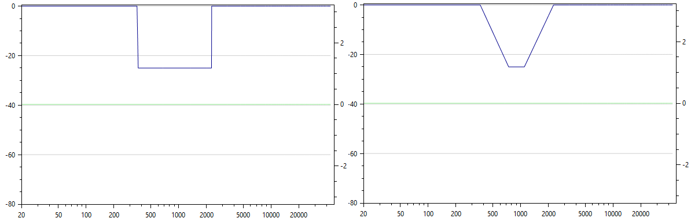

**Gain** - Change the gain by -60/+40 dB.

**Delay** - Apply a phase transformation that delays the signal in the frequency band by the specified number of samples. - Note that applying too much delay can cause the signal to get truncated away when using a short Impulse Length. Use the bottom right graph to inspect the result, making sure that the delayed signal doesn't go beyond the red vertical line that marks the end of the impulse response.

#### Gain Variation

These controls allow smoothing out or exaggerating the peaks and troughs of the frequency response.

**Smoothing** - This applies a moving average filter to the frequency response which is used as a baseline for adding or removing gain.

**Amount** - Amplifies or reduces the difference between the smoothed frequency response and the current response, resulting in larger or smaller peaks and troughs.

**Mode**
 
* Reduce - Applies gain reduction only, resulting in deeper troughs in the response.
* Bipolar - Applies both gain reduction and amplification.
* Amplify - Applies gain increase only, amplifying the peaks of the response.

Original Response. Amount = 1.0.

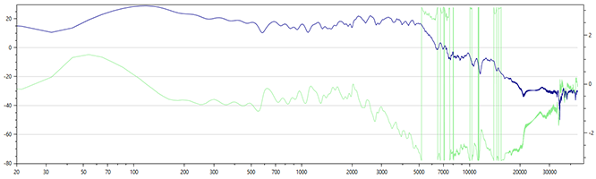

Smoothed at 0.16 Octaves, Amount = 0.0.

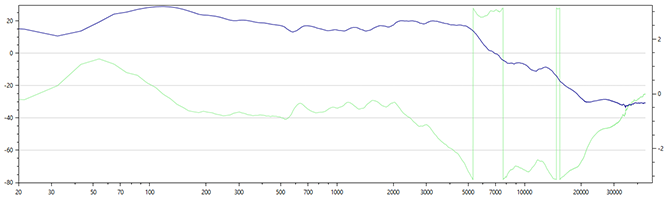

Smoothed at 0.16 Octaves, Amount = 5.4, Mode = Reduce.

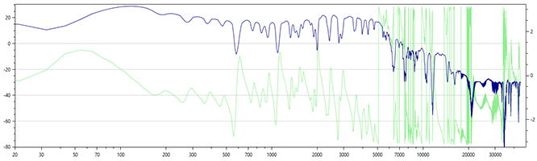

#### Gain Randomization

This transform applies a random gain change to the frequency response. It can be used to synthetically add "detail" to the frequency response, adding "phasiness" and simulating resonant frequencies.

**Smoothing** - Applies a moving average filter to the random noise to control how sharp the resulting peaks and troughs are.

**Random seed / Random shift** - Controls the random number generator used to produce the effect. A different seed will result in a completely new random sequence, but shift allows you to move the resulting sequence up or down in the frequency domain.

**Amount** - the random gain added to the frequency response.

**Skew** - Adjusts how narrow or wide the resulting peaks are.

**Mode**
 
* Reduce - Applies gain reduction only, resulting in added troughs in the response.
* Bipolar - Applies both gain reduction and amplification.
* Amplify - Applies gain increase only, resulting in added peaks in the response.

Original Response.

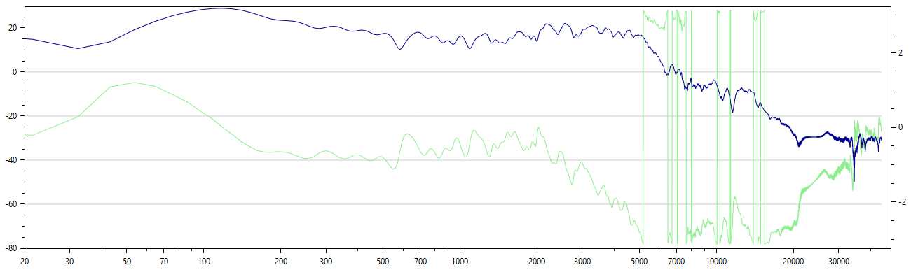

Randomization added between 480 - 3.6Khz, Smoothing = 9 Samples, Amount = 20dB, Mode = Reduce.

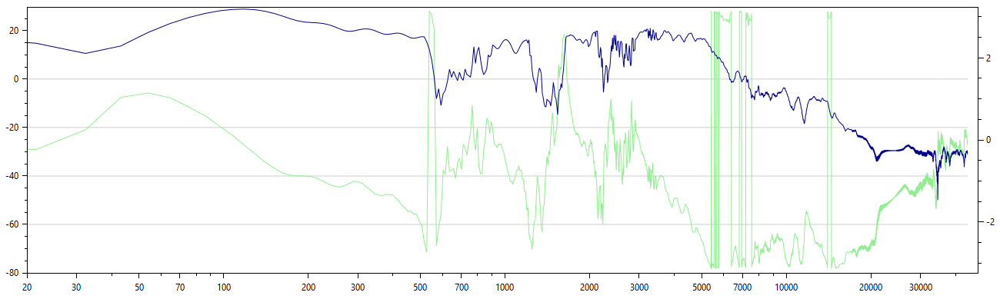

#### Frequency Skew

**Skew Amount** - Expands or contracts the gain response, in the frequency domain. This moves all resonant frequencies up or down, to simulate a smaller or large speaker cabinet. Note: Try adjust the Min and Max Frequency for increased control over the effect.

**Pin to High** - When checked, will contract or expand *towards* the high frequency of the spectrum stage, rather than the low frequency.

#### Phase Bands

This effect applies changes the phase response of the signal. It splits the signal into a number of bands, and then applies a random delay to each band. In a mono signal, the effect is subtle, but when applying different amounts of shift to two impulses, panned left and right, it will create a stereo enhancing effect which can be very pleasant. The same principle is used in the Stereo Space effect (see Post Processing section).

**No. Bands** - Sets how many bands the signal gets split into.

**Amount** - The maximum amount of delay (in samples) that gets applied to each band. This is scaled by a random variable for each band.

**Freq Track** - Controls how much effect is applied at the upper and lower bands.

* When positive - The lower bands receive less effect than the higher bands.
* When negative - The higher bands receive less effect than the lower bands.
* At zero - All bands receive the full amount of effect. 

### Output Stage

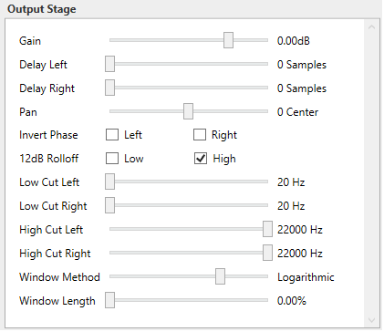

This section contains various controls for how the impulse response gets mixed into the final output.

**Gain** - Controls the overall gain of the selected impulse response.

**Delay Left / Right** - Delays the left and right channels by the specified number of samples. Note that too much delay can move the signal beyond the impulse response window, so that part or all of it is truncated away. Refer to the chart on the right side to visually inspect what is happening. 

The plot below shows a signal where the right channel has been delayed by 412 samples, or about 9 milliseconds. The light-red vertical line shows the maximum length of the impulse response, anything beyond this line gets discarded.
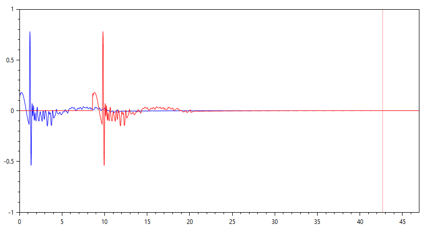

**Pan** - Controls left to right panning. At "0 Center" both left and right channels receive the full strength signal.

**Invert Phase** - Inverts the phase of the left and/or right channel.

**12dB rolloff** - Controls the steepness of the Low and High Cut filters. When selected, applies a 12dB/Octave rolloff rather than a 6dB rolloff.

Red curve shows 6dB High Cut rolloff, while Green curve shows 12dB High Cut.

**Low/High Cut Left/Right** These controls adjust the high and low cut filters applied to the output signal.

**Window Method** Controls how the impulse response is truncated, i.e. the "fade-out" at the end. I recommend trying out different methods and using your ears to determine what sounds best.

* Truncate - A hard cut-off, going from full gain to zero. Generally not recommended.
* Linear - A linear slope from full gain to zero. Results in a quick transition which retains detail but can sometimes result in high-frequency artefacts. 
* Logarithmic - A logarithmic (dB) slope from full gain to zero. Results in a smooth transition but can loose some detail.
* Cosine - Uses the shape of a Cos(0...pi/2) function to cut the signal. Provide a good compromise between a fast transition and limited high-frequency artefacts.

**Window Length** The duration of the "fade-out", as a percentage of the full duration of the impulse response (from 0% to 50%).

## 4. Post Processing

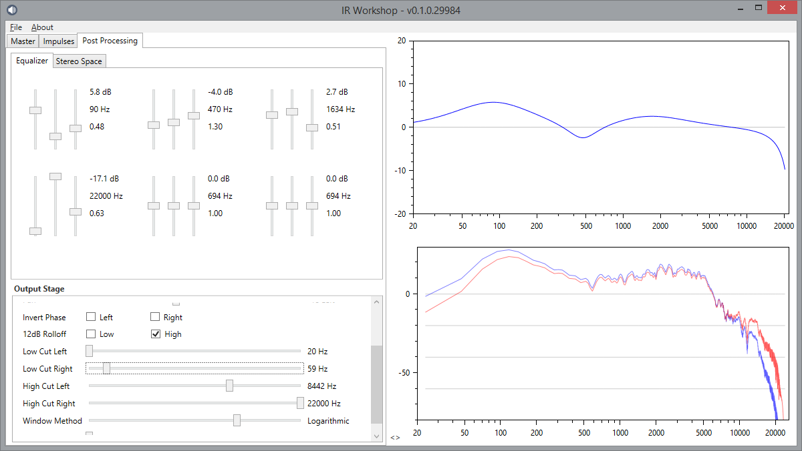

The Post Processing tab contains 3 main sections:

* 6 Band Parametric Equalizer.
* Stereo Enhancer.
* Output Stage.

The Output Stage is identical to the one found on the Impulse panel.

### Parametric Equalizer

The equalizer has 6 individual peaks or notches that can be adjusted from 20hz-22Khz, and +- 20dB, with a variable "Q" factor.

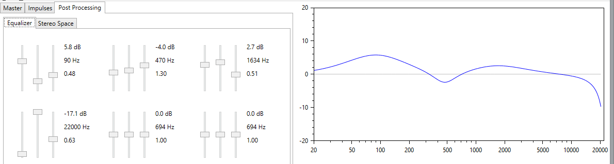

**Slider 1** - Controls the Gain, from -20dB to +20dB.

**Slider 2** - Controls the Frequency, from 20Hz to 22Khz.

**Slide 3** - Controls the "Q factor", i.e. how narrow or wide the band is. 

### Stereo Space

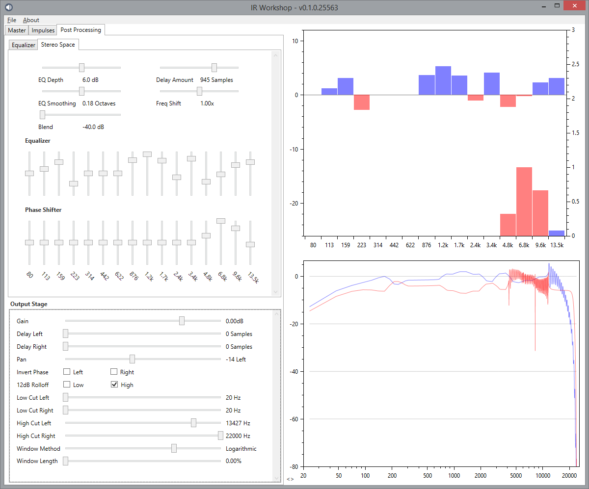

The Stereo Space section can be used to:

* Enhance the stereo width of a stereo signal.
* Convert an entirely mono signal into a rich stereo signal.

The effect consists of two stages, an equalizer and a phase shifter. A plot is shown on the top right side to assist in understanding the effect. Both effects are applied to a range of 16 frequency bands, which can be adjusted using the "Freq Shift" slider. The center of each band can be seen below the sliders on the left side, and on the plot on the right side.

**Freq Shift** - This slider controls the center frequency of each of the 16 bands. They can be adjusted from a range of 40Hz-6.8Khz, to 120Hz-20.3Khz.

#### Stereo Equalizer

This effect works by boosting a frequency band on one side, and simultaneously cutting the band on the other side. This creates a difference in the harmonic content between the left and right channels, causing a perceived shift in the stereo field.

**EQ depth** - Controls the overall effect that each band can have, from 0dB to 12dB.

**EQ Smoothing** - Controls the "slope" or "blend" between each band. At its lowest setting, each band cuts in and out sharply in the frequency range, while a higher setting produces a more gradual curve.

**16 Equalizer sliders** - Dragging up will boost the left channel and cut the right channel, dragging down will do the opposite. At center, no boost or cut is added to that band.

#### Phase Shifter

This effect works very similar to the Phase Bands transformation in the Spectrum Stage (described above). It will apply a delay to the specified frequency band on either the left or right channel. This causes a difference between the left/right signals, resulting in an effect that is perceived as increased stereo width, and a faint echo, or "room" sound. Experimentation is highly recommended.

**Delay Amount** - Controls the overall delay that is added to each band.

**16 Phase Shifter sliders** - Dragging up will delay the right channel leaving the left channel unaffected, while dragging down will do the opposite. At center, no delay is added to that band on either channel.