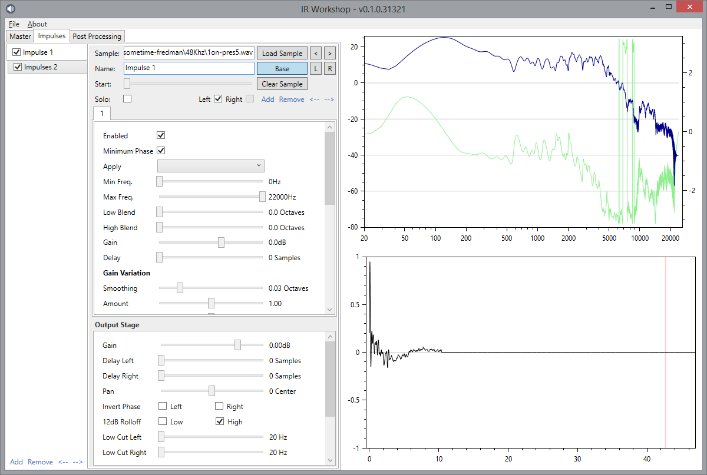

# IR Workshop - Cabinet Impulse Response Editor

This is a Windows application for mixing, editing, enhancing and creating guitar speaker cabinet impulse responses. 

*Written by Valdemar Erlingsson.*

## Features

* Live preview of your impulse response with ASIO support
* Mix, pan and filter any number of impulse responses
* Convert between samplerates
* Truncate files with minimum loss of quality
* Multiple options for frequency and phase response, including:
  * Minimum Phase Transform
  * Frequency response smoothing and exciting
  * Apply randomization to frequency response
  * "Skew" the frequency response to simulate smaller/larger resonance frequency
  * High and Low-pass filtering
* 6 Band parametric equalizer
* Stereo enhancement effects
* ...and many more

A more detailed **[User Guide is available](https://github.com/ValdemarOrn/IRWorkshop/blob/master/Guide/Readme.md)**

## Download

Grab the latest version from the **[Releases Page](https://github.com/ValdemarOrn/IRWorkshop/releases)**.

## Synthetic Impulses Pack

**A free pack of impulse responses created with IR Studio can also be downloaded from the [Releases Page](https://github.com/ValdemarOrn/IRWorkshop/releases/tag/v0.1.0)**.

## Installing and running

* No installation is required, just download the zip file and extract it anywhere on your machine.
* In the extracted folder, locate "IrWorkshop.Ui.exe" - this is the main executable.
* You must start the program in Administrator mode, or it will not work. Right click the file and choose "Run as Administrator".
* Alternatively, you can right click the file and select "Properties". Under Administrator, select the "Run this program as an administrator" option.
* This software requires .NET Framework 4.5 to operate. Most users on Windows 7 or newer will already have this installed, but it can be installed via the Windows Update panel, or [downloaded directly from Microsoft](https://www.microsoft.com/en-gb/download/details.aspx?id=30653)

## Reporting Issues

Your support is appreciated. If you do find any issues with the software, please [report issues to irworkshopsoftware@gmail.com](mailto:irworkshopsoftware@gmail.com) I will do my best to fix problems when they are reported. Please understand that I develop this software free of charge in my limited spare time.
